# 🎵 YouTube Discord Music Bot

A high-performance Discord music bot with intelligent caching and seamless playback! Built with Discord.js v14, featuring smart pre-downloading and persistent song caching for lightning-fast music streaming.

## ✨ Enhanced Features

- 🎶 **Play YouTube videos** in Discord voice channels
- ⚡ **Smart Caching System** - Songs are cached permanently for instant replay
- 🚀 **Pre-downloading** - Next songs download in background for seamless transitions
- ⏭️ **Skip Functionality** - Skip to next song with `!next` or `!skip`
- 📝 **Queue management** - Multiple songs per server with intelligent processing
- 🔄 **Zero-gap playback** - Instant song transitions with pre-cached audio
- ⏰ **Smart disconnect** - Leaves when inactive or alone
- 🏢 **Multi-server support** - Works across multiple Discord servers simultaneously
- 🐳 **Docker ready** - Easy deployment with containerization
- 💾 **Intelligent file management** - Persistent cache with automatic cleanup

## 🚀 Quick Start

### Prerequisites

- Node.js 18+ installed
- A Discord bot token
- Python 3.x (for yt-dlp)

### 📋 Setup Instructions

1. **Clone the repository**
   ```bash
   git clone https://github.com/idroid007/yt-discord-music-bot.git
   cd yt-discord-music-bot
   ```

2. **Install dependencies**
   ```bash
   npm install
   ```

3. **Create environment file**
   ```bash
   # Create .env file in the root directory
   touch .env
   ```

4. **Add your Discord bot token**
   ```env
   DISCORD_TOKEN=your_discord_bot_token_here
   ```

5. **Run the bot**
   ```bash
   npm start
   ```

## 🤖 Creating a Discord Bot

If you don't have a Discord bot token yet:

1. 🌐 Go to [Discord Developer Portal](https://discord.com/developers/applications)
2. ➕ Click "New Application" and give it a name
3. 🤖 Navigate to "Bot" section in the sidebar
4. 🔧 Click "Add Bot"
5. 📋 Copy the bot token (keep it secret!)
6. 🔐 Under "Privileged Gateway Intents", enable:
   - Message Content Intent
   - Server Members Intent (optional)

### Bot Permissions Required

When inviting your bot to a server, ensure it has these permissions:
- ✅ Read Messages
- ✅ Send Messages
- ✅ Connect to Voice Channels
- ✅ Speak in Voice Channels
- ✅ Use Voice Activity

**Invite URL Template:**
```
https://discord.com/api/oauth2/authorize?client_id=YOUR_BOT_CLIENT_ID&permissions=3148800&scope=bot
```

## 🎮 Commands

| Command | Description | Example |
|---------|-------------|---------|
| `!play <YouTube_URL>` | 🎵 Add song to queue and start playback | `!play https://youtube.com/watch?v=dQw4w9WgXcQ` |
| `!next` or `!skip` | ⏭️ Skip to the next song in queue | `!next` |
| `!stop` | 🛑 Stop playback and clear queue | `!stop` |

### 🎯 Smart Playback Features

- **Instant Replay**: Previously played songs load instantly from cache
- **Background Pre-loading**: Next songs download while current song plays
- **Seamless Transitions**: Zero-gap playback between songs
- **Queue Intelligence**: Smart detection of cached vs new songs

## 🐳 Docker Deployment

### Using Docker

1. **Build the image**
   ```bash
   docker build -t discord-music-bot .
   ```

2. **Run the container**
   ```bash
   docker run -d --name music-bot -e DISCORD_TOKEN=your_token_here discord-music-bot
   ```

### Using Docker Compose

Create a `docker-compose.yml` file:
```yaml
version: '3.8'
services:
  music-bot:
    build: .
    environment:
      - DISCORD_TOKEN=your_discord_bot_token_here
    restart: unless-stopped
    volumes:
      - ./temp:/app/temp
```

Run with:
```bash
docker-compose up -d
```

## 📁 Project Structure

```
yt-discord-music-bot/
├── 📄 app.js              # Main bot logic with caching system
├── 📦 package.json        # Dependencies and scripts
├── 🐳 Dockerfile         # Container configuration
├── 📁 temp/              # Cached audio files (persistent storage)
│   ├── 🎵 {videoId}.webm  # Cached songs (e.g., dQw4w9WgXcQ.webm)
│   └── 🔄 predownload_*   # Pre-downloading files
├── 🔧 .env               # Environment variables (create this)
└── 📖 README.md          # This file
```

## ⚙️ Configuration

### Environment Variables

| Variable | Description | Required | Default |
|----------|-------------|----------|---------|
| `DISCORD_TOKEN` | Your Discord bot token | ✅ Yes | None |

### Bot Settings

- **Command Prefix**: `!` (hardcoded)
- **Inactivity Timeout**: 5 minutes
- **Audio Format**: WebM Opus (best quality)
- **Cleanup Interval**: 10 minutes
- **Caching**: Permanent storage with video ID naming
- **Pre-download**: Enabled for queue optimization

## 🎯 How to Use

### Basic Usage
```bash
# Join a voice channel, then:
!play https://www.youtube.com/watch?v=dQw4w9WgXcQ  # Add and play song
!play https://www.youtube.com/watch?v=oHg5SJYRHA0  # Add to queue (pre-downloads)
!next                                             # Skip to next song
!stop                                             # Stop and clear queue
```

### Advanced Usage Patterns

#### **Building a Playlist**
```bash
!play https://youtube.com/watch?v=song1    # Starts playing immediately
!play https://youtube.com/watch?v=song2    # Queued + pre-downloading
!play https://youtube.com/watch?v=song3    # Queued + pre-downloading
# Songs 2 & 3 are downloading in background while song1 plays
```

#### **Instant Replay**
```bash
!play https://youtube.com/watch?v=dQw4w9WgXcQ    # First time: downloads
# Later...
!play https://youtube.com/watch?v=dQw4w9WgXcQ    # Instant playback! ⚡
```

#### **Smart Queue Management**
```bash
# If you have 3 songs in queue and want to skip:
!next    # Skips to song 2 (already pre-downloaded)
!next    # Skips to song 3 (already pre-downloaded)  
!next    # "No next song available" message
```

## 🔧 Technical Details

### 🚀 Intelligent Caching System

The bot features an advanced caching mechanism that dramatically improves performance:

#### **How It Works:**
1. **Unique Identification**: Each song is identified by its YouTube video ID
2. **Persistent Storage**: Songs are saved as `{videoId}.webm` in the `temp/` directory
3. **Smart Lookup**: Before downloading, the bot checks if the song already exists
4. **Instant Playback**: Cached songs play immediately without any download delay

#### **Cache Flow:**
```
1st Play: URL → Extract videoId → Download → Save as {videoId}.webm → Play
2nd Play: URL → Extract videoId → Find {videoId}.webm → Play Instantly! ⚡
```

#### **Pre-downloading Intelligence:**
- Songs in queue are downloaded in the background while current song plays
- Next song is ready before current song ends = zero-gap transitions
- Pre-downloading skipped for already cached songs (efficiency)

### 🎵 Audio Pipeline

```mermaid
graph LR
    A[YouTube URL] --> B[Video ID Extract]
    B --> C{Cached?}
    C -->|Yes| D[Instant Play ⚡]
    C -->|No| E[Download & Cache]
    E --> F[Play + Pre-download Next]
    F --> G[Seamless Transition]
```



### Dependencies

- **discord.js** v14.21.0 - Discord API wrapper
- **@discordjs/voice** v0.18.0 - Voice connection handling
- **yt-dlp-exec** v1.0.2 - YouTube video downloading
- **play-dl** v1.9.7 - YouTube URL validation
- **ffmpeg-static** v5.2.0 - Audio processing

### File Management System

#### **Smart Caching Strategy:**
- **Filename Format**: `{11-character-video-id}.webm` (e.g., `dQw4w9WgXcQ.webm`)
- **Persistent Storage**: Cached files survive bot restarts
- **Background Processing**: Pre-downloading happens during playback
- **Memory Efficiency**: Only active files are tracked in memory

#### **File Types:**
```
temp/
├── dQw4w9WgXcQ.webm          # Cached song (permanent)
├── predownload_123456_*.webm  # Pre-downloading (temporary)
└── discordbot_123456_*.webm   # Legacy temp files (auto-cleanup)
```

#### **Cleanup Intelligence:**
- ✅ **Keep**: Cached songs (`{videoId}.webm` format)
- 🗑️ **Remove**: Old temporary files, failed downloads
- 🔄 **Smart Tracking**: Active file monitoring prevents accidental deletion

## 🛠️ Development

### Running in Development Mode

```bash
# Install dependencies
npm install

# Start with auto-restart (install nodemon first)
npm install -g nodemon
nodemon app.js
```

### Adding Features

The bot architecture supports easy extension:
- Queue management in `queues` Map
- Command handling in `messageCreate` event
- Audio processing in `playSong()` function

## 🐛 Troubleshooting

### Common Issues

**Bot doesn't respond to commands:**
- ✅ Check if bot has "Message Content Intent" enabled
- ✅ Verify bot has "Read Messages" permission in the channel
- ✅ Ensure you're using the correct prefix (`!`)

**Audio doesn't play:**
- ✅ Bot needs "Connect" and "Speak" permissions in voice channel
- ✅ Make sure you're in a voice channel when using `!play`
- ✅ Check if the YouTube URL is valid and accessible

**Songs skip or don't queue properly:**
- ✅ Use `!next` only when songs are in queue
- ✅ Cached songs load instantly - this is normal behavior
- ✅ Check console logs for pre-download status

**Cache/Storage issues:**
- ✅ Ensure the bot has write permissions to the `temp/` directory
- ✅ Monitor disk space - cached songs persist between restarts
- ✅ Cached files use format `{videoId}.webm` for easy identification

**Bot crashes:**
- ✅ Ensure Python 3.x is installed (required for yt-dlp)
- ✅ Check your Discord token is correct
- ✅ Verify all dependencies are installed

### Performance Tips

**Optimal Usage:**
- 🎵 Build playlists to maximize pre-downloading benefits
- 🔄 Replay popular songs to leverage caching
- ⚡ Use `!next` for instant skipping (no download delay)

**Storage Management:**
- 📁 Cached songs in `temp/` folder persist between bot restarts
- 🧹 Manual cleanup: Delete `temp/*.webm` files if needed
- 📊 Monitor folder size - popular songs are kept permanently

### Logs

The bot provides detailed console logging for:
- ✅ Connection status and guild activities
- ❌ Errors and warnings with context
- 🧹 File cleanup operations and cache management
- 🔌 Voice channel connections and disconnections
- 🎵 Song caching status (cached/pre-downloaded/fresh download)
- ⚡ Performance metrics (instant vs download times)

#### **Log Examples:**
```
✅ Logged in as MusicBot#1234
🎵 Using cached file: https://youtube.com/watch?v=dQw4w9WgXcQ
🔄 Pre-downloading: https://youtube.com/watch?v=oHg5SJYRHA0
✅ Pre-downloaded and cached: https://youtube.com/watch?v=oHg5SJYRHA0
⏭️ Skipped to next song.
```

## 📄 License

This project is licensed under the ISC License.

## 🤝 Contributing

1. 🍴 Fork the repository
2. 🌿 Create a feature branch (`git checkout -b feature/amazing-feature`)
3. 💾 Commit your changes (`git commit -m 'Add amazing feature'`)
4. 📤 Push to the branch (`git push origin feature/amazing-feature`)
5. 🔀 Open a Pull Request

## 🌟 Support

If you find this bot useful, please consider:
- ⭐ Starring the repository
- 🐛 Reporting bugs via Issues
- 💡 Suggesting new features
- 🤝 Contributing code improvements

## 📞 Contact

- GitHub: [@idroid007](https://github.com/idroid007)
- Repository: [yt-discord-music-bot](https://github.com/idroid007/yt-discord-music-bot)

---

Made with ❤️ for the Discord community
